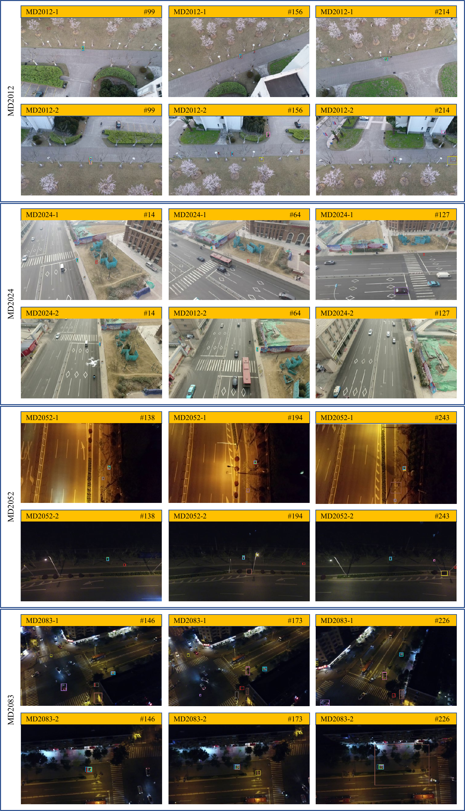

# FAEMTrack
## FAEMTrack: Feature-Augmented Embedding and Cross-Drone
Fusion for Single Object Tracking
In this project, we introduce FAEMTrack, a state-of-the-art multi-drone tracking framework designed to tackle occlusion, viewpoint variation, and target disappearance in challenging environments. FAEMTrack integrates a Feature-Augmented Embedding Module (FAEM)—which replaces standard convolutions with multi-scale depthwise convolution blocks (MSDB) and a spatial attention (SA) mechanism to enrich spatial–semantic encoding—and an entropy-weighted cross-drone fusion strategy that dynamically balances per-drone response confidence for adaptive, collaborative tracking. Extensive experiments on the MDOT benchmark demonstrate that FAEMTrack achieves superior accuracy and robustness compared to existing single- and multi-drone methods.  
<div  align="center">    
 
</div>  
<br>

## 1. Installation
#### Install dependencies
* Create and activate a conda environment 
    ```bash
    conda create -n FAEMTrack  python=3.7
    conda activate FAEMTrack 
    ```  
* Install PyTorch
    ```bash
    conda install -c pytorch pytorch=1.8.0 torchvision=0.9.0 cudatoolkit=10.2
    ```  

* Install other packages
    ```bash
    conda install matplotlib pandas tqdm
    pip install opencv-python tb-nightly visdom scikit-image tikzplotlib gdown
    conda install cython scipy
    sudo apt-get install libturbojpeg
    pip install pycocotools jpeg4py
    pip install wget yacs
    pip install shapely==1.6.4.post2
    ```  
* Setup the environment                                                                                                 
Create the default environment setting files.

    ```bash
    # Change directory to <PATH_of_FAEMTrack>
    cd FAEMTrack
    
    # Environment settings for pytracking. Saved at pytracking/evaluation/local.py
    python -c "from pytracking.evaluation.environment import create_default_local_file; create_default_local_file()"
    
    # Environment settings for ltr. Saved at ltr/admin/local.py
    python -c "from ltr.admin.environment import create_default_local_file; create_default_local_file()"
    ```
### Add FAEMTrack to your PYTHONPATH
```bash
export PYTHONPATH=/path/to/FAEMTrack:$PYTHONPATH (for linux)
set PYTHONPATH=%PYTHONPATH%;/path/to/FAEMTrack (for windows)
```

* Download the pre-trained networks   
Download the network for [FAEMTrack](https://github.com/wjh-scut/FAEMTrack/releases/tag/downloads)
and put it in the directory set by "network_path" in "pytracking/evaluation/local.py". By default, it is set to 
pytracking/networks.

## 2. Dataset
We use LaSOT, GOT-10k, TrackingNet, and COCO in this work. See [dataset](https://github.com/visionml/pytracking/tree/master/ltr) for details.

## 3. Traning
* Modify [local.py](ltr/admin/local.py) to set the paths to datasets, results paths etc.
* Runing the following commands to train the CRM-DiMP. You can customize some parameters by modifying [super_dimp.py](ltr/train_settings/dimp/super_dimp.py)
    ```bash
    conda activate FAEMTrack
    cd FAEMTrack/ltr
    python run_training.py dimp super_dimp
    ```  

## 4. Test
* CUDA_VISIBLE_DEVICES=1
    ```bash
    python pytracking/run_tracker.py dimp super_dimp --dataset_name mdot --debug 0 --threads 0
    python pytracking/run_experiment.py myexperiments FAEMTrack --debug 0 --threads 0
    ```
## 5. Evaluation
* You can use [PySOT](https://github.com/STVIR/pysot) to test and evaluate tracker.
 ```bash
    python ../../tools/eval.py 	 \ #path to eval.py
	          --tracker_path ./results \ # result path
	          --dataset MDOT        \ # dataset name
	          --num 1 		 \ # number thread to eval
	          --tracker_prefix 'FAEMTrack'   # tracker_name
 ```
## 5. Result
You can find the final raw result in [there](https://github.com/wjh-scut/FAEMTrack/releases/tag/downloads).

| Model                 | MDOT (Suc./Pre.)   | Drone1 (Suc./Pre.)| Drone2 (Suc./Pre.) |
| --------------------  | :----------------: | :---------------: | :---------------:  |
| Super-DiMP (baseline) |    0.506/0.728     |    0.536/0.769    |    0.476/0.687     |
| FAEMTrack             |    0.543/0.781     |    0.567/0.811    |    0.520/0.751     |

## 6. Visualization
Visualizing tracking results in different video sequences of MDOT.
<div  align="center">    
 
</div>  
<br>

### Acknowledgement
The code based on the [PyTracking](https://github.com/visionml/pytracking), [CRM-DiMP](https://github.com/xyl-507/CRM) and [GhostNetv2](https://github.com/huawei-noah/Efficient-AI-Backbones/tree/master/ghostnetv2_pytorch).
We would like to express our sincere thanks to the contributors.
Special thanks to [xyl-507](https://github.com/xyl-507) for his help and guidance on this project!

